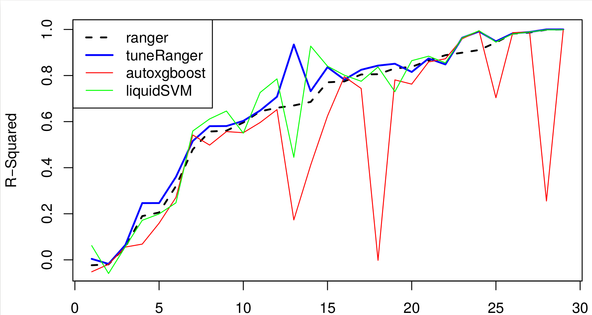

```{r setup, include=FALSE}
knitr::opts_chunk$set(echo = TRUE)

library(AppliedPredictiveModeling)
library(caret)
library(tidyverse)
library(mlbench)
library(ranger)
```

The Random Forest algorithm is often said to perform well "out-of-the-box", with no tuning or feature selection needed, even with "high-dimensonal data" , where we have a high number of features relative to the number of observations.

Here, we show that Random Forest can still be harmed by irrelevant features, and offer two ways of dealing with it. We can do so either by removing the irrelevant features (using a procedure called **recursive feature elimination (RFE)**), or by **tuning the algorithm**, increasing the number of features available during each split (the `mtry` parameter in R) during training (model building). 

Furthermore, using a simulation study were I gradually increase the amount of **noise** (irrelevant features) relative to the **signal** (relevant features), we find that at some point the RF tuning approach no longer is able to achieve optimal performance. Under such (possibly extreme) circumstances, RF feature selection keeps performing well, filtering out the signal variables from the noise variables. 

But first, why should we care about this 2001 algorithm in 2022? Shouldn't we be all be using deep learning by now (or doing bayesian statistics)?

# Why Random Forest is my favorite ML algorithm

The Random Forest algorithm ([@breiman01]) is my favorite ML algorithm for cross-sectional, tabular data. Thanks to [Marvin Wright](https://mnwright.github.io/) a fast and reliable implementation exists for R called `ranger`[@wright17]. For tabular data, RF seems to offer the highest value per unit of compute compared to other popular ML methods, such as Deep learning or Gradient Boosting algorithms such as **XGBoost**. In this setting, predictive performance is often either on par with Neural networks or Gradient boosting, or only slightly worse [@ref, Personal experience :-)].  For classification prediction models, it has been shown to outperform logistic regression [@Coronne18].

The Random Forest algorithm can provide a quick benchmark for the predictive performance of a set of predictors, that is hard to beat with models that explicitly formulate a interpretable model of a dependent variable, for example a linear regression model with interactions and non-linear transformations of the predictors. For a great talk on the Random Forest method, check out [Marvin Wright's UseR talk from 2019](https://www.youtube.com/watch?v=iVmsJJYjgNs). 

# But it is not perfect: the effect of irrelevant variables

In that talk, Prof Marvin Wright discusses the common claim that "Random Forest works well on high-dimensional data". High-dimensional data is related to the ratio between number of observations and number of variables. Data is called high-dimensional if there are many variables relative to the number of observations. This is common in genetics, when we have say complete genomes for only a handful of subjects. The suggestion is that RF can be used on small datasets with lots of (irrelevant / noise) features without having to do variable selection first. 

To check this claim, Wright shows that RF performance is unaffected by adding 100 noise variables to the `iris` dataset, a simple example classification problem with three different species. Because RF uses decision trees, it performs "automatic" feature (predictor / variable) selection, as it is part of the model building process. This property of the algorithm is used to explain this result. A tree model will simply ignore the noise predictors and choose the relevant predictors instead. 

See the accompanying R notebook [prep_and_fit.Rmd](rf_rfe_post/prep_and_fit.Rmd) that contains all the simulations I performed for this blog post. It also includes the simulation on the `iris` dataset:

```{r}
fit_list <- readRDS("rf_rfe_post/fitlist.rds")
fit_list$algo <- paste0(fit_list$method, "_mtry_", fit_list$mtry)
```

```{r}
fit_list %>% filter(ds_group == "df_iris" & algo == "ranger_mtry_default")
```

```{r, fig.width= 8, fig.height= 3}
ggplot(fit_list %>% filter(ds_group == "df_iris" & algo == "ranger_mtry_default"), aes(x = reorder(algo, performance), y = performance, col = factor(algo))) +
  geom_point() +
  geom_label(aes(label = round(performance,2)), nudge_y = -0.02, nudge_x = +0.1) +
  geom_segment(aes(xend = algo, y = 0, yend = performance)) +
  coord_flip() +
  facet_wrap(~ ds_name)
```
Indeed, the performance (here i looked at *Accuracy* as percentage of observations correctly classified) is hardly affected.

However, a counter example, where adding irrelevant features **does hurt** performance, is quickly found. In [Chapter 20](https://topepo.github.io/caret/recursive-feature-elimination.html) of the documentation of `caret`, a popular ML package in `R`, Max Kuhn  the regression problem **Friedman 1** to illustrate the problem, as well as a possible solution. See for a different example in the literature [@genuer_variable_2010]. 

`mlbench.friedman1()` simulates the regression problem **Friedman 1** . Inputs are 10 independent variables uniformly distributed on the interval [0,1], only 5 out of these 10 are actually used. Outputs are created according to the formula:

$y = 10 sin(\pi x_1 x_2) + 20 (x_3 - 0.5)^2 + 10 x_4 + 5 x_5 + \epsilon$

where $\epsilon$ is distributed $Normal(0, 1)$.

(source: Friedman (1991) and Breiman (1996) [@Friedman91] [@Breiman96])

Only five predictors contain signal, whereas the other 45 contain noise. Random Forest with its default setting of `mtry` shows poor performance, and only after performing feature selection (removing the irrelevant variables) optimal performance is achieved.

I also reproduced this analysis, but with N = 1000 and with 0, 100 and 500 **additional** noise variables added.

```{r, fig.width= 8, fig.height= 3}
ggplot(fit_list %>% filter(ds_group == "df_friedman1" & algo %in% c("ranger_mtry_default")), aes(x = reorder(algo, performance), y = performance, col = factor(algo))) +
  geom_point() +
  geom_label(aes(label = round(performance,2)), nudge_y = -0.02, nudge_x = +0.1) +
  geom_segment(aes(xend = algo, y = 0, yend = performance)) +
  coord_flip() +
  facet_wrap(~ ds_name)
```
The optimal performance is achieved if we include only relevant predictors $x_1, x_2,x_3,x_4, x_5$ in the RF algorithm. 
This model has an R-squared of around 88% (not shown). RF including both signal and five noise predictors, using the default `mtry` value shows a slight drop in performance to 84%. After including an additional 100 noise variables, performance drops further to 56%. And if we add 500 instead of 100 additional noise variables, performance drops further to 34% R2.

So how to solve this? In this blog post, I will compare both RF **hyperparameter tuning** and **feature selection** in the presence of many irrelevant features.

# Tuning RF or removing the irrelevant features?

It seems that most practical guidance to improve RF performance is on *tuning the algorithm hyperparameters*, arguing that Random Forest as a tree-based method has built-in feature selection, alleviating the need to remove irrelevant features. 

This is demonstrated by the many guides on (RF/ML) algorithm tuning found online. For example, a currently popular book "Hands-On Machine Learning" by Géron contains a short paragraph on the importance of selecting / creating relevant features, but then goes on to discuss hyperparameter tuning at great length for the remainder of the book. 

In their online book **Feature Engineering and Selection: A Practical Approach for Predictive Models**, Max Kuhn and Kjell Johnson have a section called [Effect of Irrelevant Features](http://www.feat.engineering/feature-selection-simulation.html). For simulated data with 20 informative predictors, they find that after tuning (which is not mentioned in the book but is clear from the [R code provided on Github](https://github.com/topepo/FES_Selection_Simulation)), RF is (mostly) robust to up to 200 extra noise variables. 

So let's start with RF tuning.

# The effect of RF tuning demonstrated on OpenML datasets

To experiment with RF tuning and compare it with RF feature selection, I needed datasets.  Using simulated data is always an option, but with such data it is not always clear what the practical significance of our findings is.

So I needed (regression) datasets that are not too big, nor too small, and where RF tuning has a substantial effect. Finding these was not easy: Surprisingly, online tutorials for RF hyperparameter tuning often only show small improvements in performance.

Here the benchmarking study of Philippe Probst on RF tuning came to the rescue, as he identified three datasets where RF tuning has a significant effect. Probst created a suite of 29 regression datasets (`OpenML-Reg-19`), where he compared tuned ranger with default ranger. The selection of the datasets is described [here](https://github.com/PhilippPro/OpenML-bench). The datasets he used are all made available by [OpenML.org](https://new.openml.org/). This is a website dedicated to reproducible, open ML, with a large collection of datasets, focused on benchmarking and performance comparison. 

Furthermore, For the RF tuning, he created an R package, aptly called `tuneRanger` [Github repo](https://github.com/PhilippPro/tuneRanger). 

Ignoring the red and green lines, and comparing the tuned vs default ranger, it is clear that on many datasets, tuning hardly improves things. Here we see the reputation of RF, that it works well straight out of the box, borne out in practice.

However, a few did, and three stood out (blue line above dashed line).



As he made all his code available on Github, I could identify the three datasets as being `tecator`, `bodyfat` and `puma32H`.
Puma32H is noteworthy in that it is a classic ML dataset for a simulated PUMA 560 robotarm, that contains mostly irrelevant features (30 out of 32) [@geurts06].


For these three datasets, I reproduced the results of default `ranger()` and tuned the `mtry` parameter.

mtry? what try?

# RF tuning: the mtry parameter

A great resource for tuning RF is a 2019 review paper by Probst et al. called  'Hyperparameters and Tuning Strategies for Random Forest'. 

They conclude:

*Out of these parameters, mtry is most influential both according to the literature and in our own experiments. The best value of mtry depends on the number of variables that are related to the outcome.*

In this blog post, we use `mtry` as the only tuning parameter of Random Forest. This is the number of randomly drawn features that is available to split on as the tree is grown. It can vary between 1 and the total number of features in the dataset. From the literature and my own experience, this is the hyperparameter that matters most.

Reproducing the results using `ranger()` myself, and playing around with the `mtry` parameter, I discovered that the three datasets have something in common: they all contain only a few variables that are predictive of the outcome, in the presence of a lot of irrelevant variables. Furthermore, setting `mtry` at its maximum value was sufficient to achieve the performance shown in the blue line above. 

```{r, fig.width= 8, fig.height= 3}
ggplot(fit_list %>% filter(ds_group == "openML" & algo %in% c("ranger_mtry_default", "ranger_mtry_max")), aes(x = reorder(algo, performance), y = performance, col = factor(algo))) +
  geom_point() +
  geom_label(aes(label = round(performance,2)), nudge_y = -0.02, nudge_x = +0.1) +
  geom_segment(aes(xend = algo, y = 0, yend = performance)) +
  coord_flip() +
  facet_wrap(~ ds_name)
```
That tuning `mtry` for a Random Forest is important in the presence of many irrelevant features was already shown by Hastie et al. [@hastie_elements_2009] in 2009. They showed that if `mtry` is kept at its default (square root of $p$, the total number of features), as more irrelevant variables are added, the probability of the **relevant** features being selected for splitting becomes too low, decreasing performance. So for datasets with a large proportion of irrelevant features, `mtry` tuning (increasing its value) is crucially important.

Before we move on to RF feature selection, let's see what else we can tune in RF apart from `mtry`.

# Random forest hyperparameter tuning: what else can we tune?

With respect to the other parameters, a quick rundown:

I left the `num.trees` at its default (500), and chose "variance" as the `splitrule` for regression problems, and "gini" for classification problems (alternative is "extratrees" which is more recent but I have yet to see convincing results that demonstrate it is superior). 

I played around a bit with the `min.node.size` parameter, for which often the sequence 5,10,20 is mentioned to vary over. Setting this larger should reduce computation, since it leads to shorter trees, but for the datasets here, the effect is on the order of say 10% reduction, which does not warrant tuning it IMO. I left this at its default of 5 for regression and 1 for classification.

Finally, Marvin Wright points to results from Probst 2019 [@probst2019] that show `sample.fraction` to be an important parameter as well. This determines the number of samples from the dataset to draw for each tree. I have not looked into this, instead I used the default setting from `ranger()` which is to sample with replacement, and to use all samples for each tree, i.e `sample.fraction = 1`. 

To conclude: we focus on `mtry` and leave the rest alone.

# From RF tuning to RF feature selection

A natural question to ask is why not simple get rid of the irrelevant features? Why not perform feature selection?
In fact, this is exactly what the `caret` project by Max Kuhn et al proposes. 

The classic book *Applied Predictive Modeling* by Kuhn and Johnson (2013) contains a similar experiment showing the negative effects of including many irrelevant features in a Random Forest model (chapter 18). However, instead of tuning RF, they suggest **removing the irrelevant features altogether**. Also the follow up book on Feature engineering and selection by Kuhn & Johnson from 2019 contains a chapter on this. http://www.feat.engineering/recursive-feature-elimination.html

As a corollary, it seems that **combining** feature elimination and RF tuning does not make much sense, as the default settings of Random Forest likely are close to optimal after removing the irrelevant features. 

<!--We nevertheless provide R code using `caret` for doing so. We show how this can be achieved with the `rfe()` framework of `caret`, by creating a set of custom helper functions for `rfe()`. -->

# RF Feature selection

To perform feature selection, we use the recursive feature elimination (RFE) procedure, implemented for `ranger` in `caret`.
This is a backward feature selection method, starting will all predictors and in stepwise manner dropping the least important features [@guyon02].

    When the full model is created, a measure of variable importance is computed that ranks the predictors from most important to least. […] At each stage of the search, the least important predictors are iteratively eliminated prior to rebuilding the model.

— Pages 494-495, Applied Predictive Modeling, 2013.

(Computationally, I think it makes more sense to start with only the most relevant features and add more features in a stepwise fashion until performance no longer improves but reaches a plateau. But that would require writing my own "forward procedure", which I save for another day.)

As this is procedure that drops predictors that do not correlate with the outcome, we have to be extremely careful that we end up with something that generalizes to unseen data. In the book **Applied predictive Modeling** the authors convincingly show that a special procedure is necessary, with two loops of cross validation first described by [@Ambroise02]. The outer loop sets aside one fold that is not used for feature selection (and optionally model tuning), whereas the inner loop selects features and tunes the model. See for detailed documentation and examples [here](http://www.feat.engineering/selection-overfitting.html#selection-overfitting)):

Typically, as we start removing irrelevant features, performs either stays constant or even increases until we reach the point where features that are predictive of the outcome are getting removed. 

Note that we do not tune the `mtry` variable of RF in this procedure. Empirically, it has been observed that this only leads to marginal improvements (Kuhn & Johnson feature selection book, Svetnik paper 2004). Conceptually, tuning `mtry` is a way to reduce the effect of irrelevant features. Since we are applying a procedure to remove the irrelevant features, it makes sense that it has little benefit here.

<!-- While mtry is a tuning parameter for random forest models, the default value of mtry≈sqrt(p) tends to provide good overall performance. While tuning this parameter may have led to better performance, our experience is that the improvement tends to be marginal -->

Indeed, this is also what we find on the three OpenML datasets. Both the RF tuning approach (Setting `mtry` at its maximum value) as well as the RF feature selection using RFE result in optimal performance:

```{r}
ggplot(fit_list %>% filter(ds_group == "openML"), aes(x = reorder(algo, performance), y = performance, col = factor(algo))) +
  geom_point() +
  geom_label(aes(label = round(performance,2)), nudge_y = -0.2, nudge_x = +0.1) +
  geom_segment(aes(xend = algo, y = 0, yend = performance)) +
  coord_flip() +
  facet_wrap(~ ds_name)
```

Can RF feature selection ("ranger-rfe" in the plot below) solve our problems with the "Friedman 1" simulated data as well? 

```{r}
ggplot(fit_list %>% filter(ds_group == "df_friedman1"), aes(x = reorder(algo, performance), y = performance, col = factor(algo))) +
  geom_point() +
  geom_label(aes(label = round(performance,2)), nudge_y = -0.2, nudge_x = +0.1) +
  geom_segment(aes(xend = algo, y = 0, yend = performance)) +
  coord_flip() +
  facet_wrap(~ ds_name)
```
Yes, it can! And here we see that RF tuning is not enough, we really need to identify and remove the irrelevant variables.

A similar pattern is seen for the `solubility` dataset with noise added, used by Kuhn & Johnson in `Applied Predictive Modelling`:

```{r}
ggplot(fit_list %>% filter(ds_group == "solubility" & ds_name != "solubility_N500_perm"), aes(x = reorder(algo, performance), y = performance, col = factor(algo))) +
  geom_point() +
  geom_label(aes(label = round(performance,2)), nudge_y = -0.2, nudge_x = +0.1) +
  geom_segment(aes(xend = algo, y = 0, yend = performance)) +
  coord_flip() +
  facet_wrap(~ ds_name)
```
Note that on the original `solubility` dataset, neither tuning nor feature selection is needed, RF already performs well out of the box. 

# Doing it wrong: RF tuning after RFE feature selection on the same data

Finally, we echo others in stressing the importance of using a special nested cross-validation loop to perform the feature selection and performance assessment, especially when a test set is not available. "If the model is refit using only the important predictors, model performance almost certainly improves" according to Kuhn & Johnson (APM 2013).

To drive the point home, I have taken the `solubility` dataset with 500 noise predictors added (951 observation, with in total 228 + 500 = 728 predictors), and scrambled the $y$ variable we wish to predict.

All three RF modeling approaches now correctly report an R-squared of 0%.

```{r}
ggplot(fit_list %>% filter(ds_name == "solubility_N500_perm"), aes(x = reorder(algo, performance), y = performance, col = factor(algo))) +
  geom_point() +
  geom_label(aes(label = round(performance,2)), nudge_y = -0.2, nudge_x = +0.1) +
  geom_segment(aes(xend = algo, y = 0, yend = performance)) +
  expand_limits(y = 0.9) +
  coord_flip() +
  facet_wrap(~ ds_name)
```
However, if we retrain the model with RF (for example, to tune `mtry`) **after** RFE feature selection, we get cross-validated R-squares of 5-10%, purely based on noise variables. For full code see the [R notebook ](rf_rfe_post/prep_and_fit.Rmd)

(Note that I had to play around a bit with the RFE settings to not have it pick either the model with all features or the model with only 1 feature: using `RMSE` as a metric, and setting `pickSizeTolerance` made it pick a model with 75 predictors. Retraining this model using `caret::train` gave me the result below)

```{r}
trainObject <- readRDS("rf_rfe_post/post_rfe_train.rds")

trainObject
```
This illustrates the dangers of performing massive variable selection exercises without the proper safeguards.
Aydin Demircioğlu wrote a paper that identifies several radiomics studies that got it wrong, and performed cross-validation as a separate step after feature selection [@Demircioglu21].

# Conclusions

To conclude: we have shown that in the presence of (many) irrelevant variables, RF performance suffers and something needs to be done. 
This can be either tuning the RF, most importantly increasing the `mtry` parameter, or identifying and removing the irrelevant features using the RFE procedure `rfe()` part of the `caret` package in R. Selecting only relevant features has the added advantage of providing insight into which features contain the signal.

Interestingly, on the "real" datasets (openML, the solubility QSAR data) both tuning and feature selection give the same result. Only when we use simulated data (Friedman1), or if we add noise to real datasets (iris, solubility)) we find that `mtry` tuning is not enough, and removal of the irrelevant features is needed to obtain optimal performance. 

The fact that tuning and feature selection are rarely compared head to head might be that both procedures have different implicit assumptions: tuning is often performed on datasets that are thought to contain mostly relevant predictors, whereas feature selection is often performed on high-dimensional datasets where prior information already tells us that relatively few predictors are related to the outcome.

# References

[@Friedman96]

[@Breiman01] Random Forest

[@guyon02]

[@Ambroise02] [Selection bias in gene extraction on the basis of microarray gene-expression data](https://www.pnas.org/content/99/10/6562.short)

[@svetnik03] Svetnik, V, A Liaw, C Tong, C Culberson, R Sheridan, and B Feuston. 2003. 
Random Forest: A Classification and Regression Tool for Compound Classification and QSAR Modeling

There is no evidence that performance actually improves with descriptor selection. Also, the default mtry has the best
performance. 
[...]
However, it is still important for users to investigate the sensitivity of Random Forest to changes
in mtry or descriptor selection, as illustrated in the COX-2 classification data, where mtry = p turned out to be the best
choice. For further discussion of descriptor selection with Random Forest, see ref 33.

The exceptional case is the COX-2 classification data. In this case, mtry = p (bagging) is the best performer, as can be seen in Figure 3, although descriptor reduction (RFE) only degrades performance.

[@svetnik04] Application of Breiman’s Random Forest to Modeling Structure-Activity Relationships of Pharmaceutical Molecules

Without any parameter tuning, the performance of Random Forest with default settings on six publicly available data sets is already as good or better than that of three other prominent QSAR methods: Decision Tree, Partial Least Squares, and Support Vector Machine. In addition to reliable prediction accuracy, Random Forest provides variable importance measures which can be used in a variable reduction wrapper algorithm. (**RFE**)

*We have never yet observed a case where the performance actually improves as variables are reduced*

[@svetnik04] Svetnik, V.; Liaw, A.; Tong, C. Variable selection in random forest with application to quantitative structure-activity relationship. In Proceedings of the 7th Course on Ensemble Methods for Learning Machines; Intrator, N., Masulli, F., Eds.; Springer-Verlag: Berlin, 2004; submitted

It is shown that the non-recursive version of the procedure outperforms the recursive version, and that the default Random Forest mtry function is usually adequate.

[@geurts06] 

[@genuer_variable_2010] variable selection using random forests

*The main contribution is twofold: to provide some insights about the behavior of the variable importance index based on random forests and to propose a strategy involving a ranking of explanatory variables using the random forests score of importance and a stepwise ascending variable introduction strategy*
<!-- four classification, one regression, Ozone -->

[@kuhn13] Applied Predictive Modelling, with Tidymodels companion at https://github.com/topepo/tidy-apm

[@Kuhn18] Feature Engineering and Selection: A Practical Approach for Predictive Models, online at 
https://bookdown.org/max/FES

[@Couronne18] Random forest versus logistic regression: a large-scale benchmark experiment (also with Probst)

[@Probst19] Hyperparameters and Tuning Strategies for Random Forest, Arxiv

[@Demircioglu21] Measuring the bias of incorrect application of feature selection when using cross-validation in radiomics


