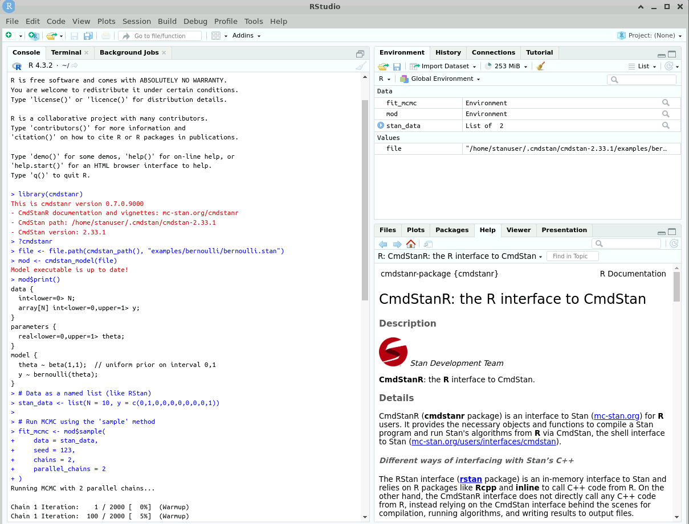

<small>
*Photo source: cropped from original by Taylor van Riper https://unsplash.com/@taylorvanriper925*

*Graphics source: Michael Betancourt at [stan-dev/propaganda](https://github.com/stan-dev/propaganda/tree/master/moore-sloan_sell_sheet/figures)*
</small>
```{r setup, include=FALSE}
knitr::opts_chunk$set(echo = TRUE)
```

Time to explore what the public cloud is all about.
Our goal is to write code (i.e. scripts) using open-source tools to automatically set up cloud infrastructure. In short, we want **Infrastructure as code**.

For this I chose a specific use case, which is **spinning up a low cost data analysis development environment with R, Rstudio and Stan tools** installed and configured. 

This has two big advantages, **reproducibility** and **lower switching cost**: 

* Scripting the compute resources that made a data analysis possible is the next level in reproducibility. 
* Ideally, we want our scripts to be independent of a particular cloud provider. This would allow us to easily change from e.g. Azure to Amazon AWS if things stagnate or we can get a better deal elsewhere.

I ended up writing Linux shell scripts that use the **Azure command-line interface (Azure CLI)** to deploy a Linux VM configured using **Cloud-init**. While doing so I discovered that being able to test changes locally first before deploying to the cloud speeds up development significantly. 

To summarize and motivate the tech choices I made:

* I chose **Azure** since my employer recently moved to Azure and me learning it would be beneficial for work.
* I chose **Azure CLI** to write simple shell scripts without the additional abstraction layer introduced by more generic tools like **Terraform/OpenTofu** or **Ansible**
* I chose **Linux Ubuntu OS** to keep cost down, as it is free and needs less resources than **Windows 10/11**
* I chose **Cloud-init** as it has emerged as the standard way to configure Linux cloud images across all cloud platforms
* I chose the **QEMU Quick Emulator** to run VMs locally to speed up development

The blog uses Linux throughout, but the Azure CLI commands should work for Windows as well.
All scripts mentioned in this blog are available in a separate repository, [azure_cli_scripts](https://github.com/gsverhoeven/azure_cli_scripts).

# Cloud computing in Azure on a shoestring

So what do we need to pay for this low cost cloud computing data analytics VM?

For a single VM the main cost driver is the VM itself. We need at least 8GB of RAM and a minimum of 2 CPU, so we end up with a `Standard D2s` VM. At the time of writing, monthly cost, assuming 24/7 usage is 73 euro. 

(To find out about these prices in the first place: Azure shows them when you select "create new VM" in the portal)

We have two additional small cost drivers, the associated disk ("storage"), and we need to pay for a public IP address, each roughly 0.1 euro per day.

If we would bring the VM up and keep it on for a whole day we pay around 2.5 euro a day.
If we only use it for 8 hours, cost is reduced to an estimated 1 euro per day.
If we stop the VM such that the resources are released (deallocated), we only need to pay for the IP and disk storage, which is 0.2 euro per day, or 6 euro on a monthly basis. This allows us a "fast resume" option that avoids waiting 30 min to install and configure all the software. I tried this, it is a feasible strategy, it takes a minute or so to boot up.

Ok let's do it!

# Setting up our local IaaS dev environment

As mentioned above, we use both **Azure CLI** and **QEMU virtual emulator** for local VM development.

I started with creating a free account on Azure. This comes with 200 Euro free credit to spent within a month.

Then I installed `azure-cli` on my local system (Ubuntu 18.04 LTS):

```bash
#downloads the signing key from Microsoft
curl -sL https://packages.microsoft.com/keys/microsoft.asc | gpg --dearmor | sudo tee /etc/apt/trusted.gpg.d/microsoft.gpg > /dev/null 
## creates a file called microsoft.gpg in the folder where keys are stored

AZ_REPO=$(lsb_release -cs) ## outputs the codename for the linux distribution i.e. Ubuntu 18.04 = bionic
echo "deb [arch=amd64] https://packages.microsoft.com/repos/azure-cli/ $AZ_REPO main" | sudo tee /etc/apt/sources.list.d/azure-cli.list 
## writes that URL to the package resource list
sudo apt-get update
sudo apt-get install azure-cli
```

First time we use `azure-cli` locally we need authenticate:
```bash
# Log in interactively using the browser.
az login
```

Test if it works by creating and deleting a new resource group:

```bash
az group create --location westeurope --resource-group MyCoolRG -o table
```

```
Location    Name
----------  --------
westeurope  MyCoolRG

```
Great! that worked. Now let's get rid of it.

```bash
az group delete --resource-group MyCoolRG
```

Next we install **QEMU**, which stands for Quick Emulator. The documentation for Cloud-init contains a section on [how to work with QEMU](https://cloudinit.readthedocs.io/en/23.3.3/tutorial/qemu.html). This will be our local development environment to test Cloud-init scripts before launching them on the cloud.

Install QEMU:
```bash
sudo apt install qemu-kvm
```
This installs QEMU 2.11 (2018) that plays well with Ubuntu 18.04.

QEMU on Ubuntu works with hypervisor KVM to run virtual machines locally. Each virtual machine has private virtualized hardware: a network card, disk, graphics adapter, etc. For windows VMware is a popular alternative.

QEMU upon first use threw an error "/dev/kvm device: permission denied" that I fixed by adding my own user account to the `kvm` group [after reading this explanation](https://16shuklarahul.medium.com/how-to-fix-kvm-permission-denied-error-on-ubuntu-18-04-16-04-14-04-f04a6e23c0cd):

```bash
sudo adduser gertjan kvm
```

On my machine, all users in group `kvm` have `rw` access for `/dev/kvm`, thereby fixing the permission error.

```
(base) gertjan:~$ qemu-system-x86_64 --version
QEMU emulator version 2.11.1(Debian 1:2.11+dfsg-1ubuntu7.41)
Copyright (c) 2003-2017 Fabrice Bellard and the QEMU Project developers
```

# Creating the Azure infrastucture

Azure is organized as a hierarchical structure. See the schematic below.
All the components that make up the infrastructure are called *resources*. Traversing upwards through the hierarchy:

* **Resources** are contained within **resource groups**.
* **Resource groups** exist within a **subscription**.
* Finally, **subscriptions** exist within **management groups**.


In this blog post, we will create the infrastructure we need from scratch.
Our desired infrastructure consists of a single virtual network that contains a single VM.
The VM will be configured to be accessible through the internet using SSH and "Microsoft Remote Desktop" (RDP).

To quickly create a virtual machine (VM) in Azure, it is possible to use a single Azure CLI command with default values that automatically creates any required supporting resources.
However, to really understand the Azure building blocks and their dependencies, it is better to create each Azure resource separately. 
In doing so we gradually build up the infrastructure step by step.
(An official Azure tutorial by Cynthia Nottingham and others that takes a similar approach can be found [here](https://learn.microsoft.com/en-us/azure/virtual-machines/linux/create-cli-complete))

Special attention is given to secure our network and VM, because it is exposed to the public internet.
Hackers are continuously scanning the Azure network IP address ranges for vulnerable systems, so we need to defend ourselves.
We use a basic Firewall called "Network Security Group" that works with **Security Rules**.
More on our security measures below.

I chose not to use an "Availability Set" as this only makes sense for groups of VMs.

We use Linux shell **Environment Variables** to separate the actual resource configuration choices (which image, which VM type etc) from the actual Azure CLI commands that create the resources. 
All scripts that accompany this blog post are in a separate repo on Github [gsverhoeven/azure_cli_scripts](https://github.com/gsverhoeven/azure_cli_scripts). The file containing the choices is [here](https://raw.githubusercontent.com/gsverhoeven/azure_cli_scripts/main/azure_config_ubuntu.sh)

# Step-by-step guide to set up the VM

* First we create a new **Resource group**
* Then we create a **Virtual Network** with a **Subnet**
* Then we create a **Public IP**
* Then we create a **Network Security Group** & Rules
* Then we create a **Network Interface Card (NIC)**
* Then we choose the **VM image**, **VM size** and **VM storage type**
* Then we write a **Cloud-init script** to initialize the VM
* Finally we **create the VM** and enjoy the show

## Create resource Group

First we create a new *Resource Group*, `myRGtest`. 
This needs a location. Since I am in West Europe, let's choose `westeurope`.

```bash
# create shell variables
resourceGroup=myRGtest
location=westeurope
az group create --name $resourceGroup --location $location
az group show --resource-group $resourceGroup
```

## Create Virtual Network

Next we create a *Virtual Network* and a *Subnet*, as explained in [the Azure documentation](https://learn.microsoft.com/en-us/cli/azure/azure-cli-vm-tutorial-2): 

```bash
# create shell variables
vnetName=StanDEV-VNet1
subnetName=StanDEV-Subnet1
vnetAddressPrefix=10.0.0.0/16
subnetAddressPrefix=10.0.0.0/24

az network vnet create \
  --name $vnetName \
  --resource-group $resourceGroup \
  --address-prefixes $vnetAddressPrefix \
  --subnet-name $subnetName \
  --subnet-prefixes $subnetAddressPrefix
```

## Create Public IP address

Now let's create a public IP address with `az network public-ip create`. 

```bash
publicIP=TEST-public-ip
mypublicdns=gsverhoeven

echo "creating public IP address .."
az network public-ip create \
    --resource-group $resourceGroup \
    --name $publicIP \
    --sku standard \
    --dns-name $mypublicdns \
    --output $azOutput \
    --zone 1 # non-zonal IP
```

This public IP address enables us to connect to our VM from the Internet. 

This results in a Fully qualified domain name (FQDN) of `gsverhoeven.westeurope.cloudapp.azure.com`

```bash
nslookup  gsverhoeven.westeurope.cloudapp.azure.com
#Server:		127.0.0.53
#Address:	127.0.0.53#53

#Non-authoritative answer:
#Name:	gsverhoeven.westeurope.cloudapp.azure.com
#Address: 68.219.248.112
```

```bash
az network public-ip list -o table
```

```
Name            ResourceGroup    Location    Zones    Address        IdleTimeoutInMinutes    ProvisioningState
--------------  ---------------  ----------  -------  -------------  ----------------------  -------------------
TEST-public-ip  myRGtest         westeurope           104.46.41.142  4                       Succeeded

```

## Create network security group & Rules

To control the flow of traffic in and out of our VM, we use a so-called **network security group**. The following example uses `az network nsg create` to create a network security group named `myNSG`:

```bash
NetworkSecurityGroup=myNSG

az network nsg create \
    --resource-group $resourceGroup \
    --name $NetworkSecurityGroup
```

This works by defining rules that allow or deny specific traffic. 
A new NSG starts with a set of default rules, among which is the rule that all inbound traffic is blocked.
Rules are processed in priority order, with lower numbers processed before higher numbers, because lower numbers have higher priority. Once traffic matches a rule, processing stops. 

**To allow inbound connections on port 22 (to enable SSH access)**, create an inbound rule with `az network nsg rule create`. The following example creates a rule named `myNetworkSecurityGroupRuleSSH`:

```bash
echo "create SSH rule .."
az network nsg rule create \
    --resource-group $resourceGroup \
    --nsg-name $NetworkSecurityGroup \
    --name myNetworkSecurityGroupRuleSSH \
    --description "Allow SSH at port 22" \
    --protocol tcp \
    --priority 1000 \
    --destination-port-range 22 \
    --access allow \
    --output $azOutput
```

To allow **Remote Desktop traffic** to reach your Linux VM, add another network security group rule.
The following example creates a rule named `myNetworkSecurityGroupRuleRDP`:

```bash
echo "create RDP rule .."
az network nsg rule create \
    --resource-group $resourceGroup \
    --nsg-name $NetworkSecurityGroup \
    --name myNetworkSecurityGroupRuleRDP \
    --description "Allow RDP at port 3389" \
    --direction Inbound \
    --protocol tcp \
    --priority 1001 \
    --destination-port-range 3389 \
    --access allow \
    --output $azOutput \
    --source-address-prefixes $trustedIPAdress
```

Examine the network security group and rules with `az network nsg rule list`:

```bash
echo "check NSG rules .."
az network nsg rule list \
    --resource-group $resourceGroup \
    --nsg-name $NetworkSecurityGroup \
    --output table
```

## Create NIC

Virtual network interface cards (NICs) are programmatically available because you can apply rules to their use. 
In the following `az network nic create` command, we create a NIC named `myNic` and associate it with our network security group. The public IP address we created above is also associated with the virtual NIC.

```bash
echo "create NIC .."
az network nic create \
    --resource-group $resourceGroup \
    --name $NICName \
    --vnet-name $vnetName \
    --subnet $subnetName \
    --public-ip-address $publicIP \
    --output $azOutput \
    --network-security-group $NetworkSecurityGroup
```

From the dependencies, we can see that a NIC ties together:

* A Network Security Group, 
* A public IP,
* A VNet & subnet,

all within a resource group. Later on, when we create the VM, we only need to specify the NIC to bring up the VM in the virtual network with the desired NSG.

## VM Image choice

As VM image I chose **Ubuntu Server 22.04 LTS** for reasons already mentioned above.
But which one, how do we find the image we need?

Canonical, the company behind Ubuntu Linux, offers various preconfigured Ubuntu images in the Azure Marketplace.
Azure CLI can be used to programmatically interact with Azure Marketplace. I used [this blog post by Joshua Powers](https://powersj.io/posts/ubuntu-images-azure/) to learn how this works.

All images published by Canonical are discoverable using the following command:

```bash
az vm image list-skus \
--publisher Canonical \
--offer Ubuntu \
--location westeurope \
-o table
```

```
Location    Name
----------  ----------------------
westeurope  18_04-lts
westeurope  18_04-lts-gen2
westeurope  18_04-lts-minimal
westeurope  18_04-lts-minimal-gen2
...
westeurope  22_04-lts
westeurope  22_04-lts-gen2
westeurope  22_04-lts-minimal
westeurope  22_04-lts-minimal-gen2
...

```
I went with `22_04-lts`. 

## VM Size choice

There is a bewildering amount of choice regarding [different types of VMs offered by Microsoft](https://azure.microsoft.com/en-us/pricing/details/virtual-machines/series/
). As my focus is on cheap, general purpose compute, I ended up with D-series VMs.

Azureprice.net shows regional price variation, however without subscription it only shows the extent of the price variation.
My current heuristic is taking the median (i.e. middle) price, so far it seems to give a good estimate of monthly pay-as-you-go prices for west-europe.

https://azureprice.net/vm/Standard_D2s_v3?currency=EUR&timeoption=day&paymentType=payasyougo

To have a reasonable fast software install I found we need at least 8GB of mem and 2 vCPUs, this corresponds to `Standard_D2s_v3`. With this VM, cloud-init installation finishes after 23 min, after which the VM is fully operational.
This has a monthly cost of 78 euro (based on 24/7 usage).

```
`Standard` is recommended tier.
D – General purpose compute
2 – VM Size
s – Premium Storage capable
v3 – version
```

## Disk storage associated with the VM

When an Azure virtual machine is created, two disks are automatically attached to the virtual machine.

The disk that holds the VM image (in our case Ubuntu 22) is called the **OS disk**. In Azure, the [default OS disk size for Linux VMs](https://learn.microsoft.com/en-us/azure/virtual-machines/linux/expand-disks?tabs=ubuntu) is currently at 30 GB. This appears to also be the minimum OS disk size, there is only the option to expand them. The OS disk is labeled `/dev/sda` by default.

In addition, there is a **temp disk** mounted that is physically located on the Azure host where the VM is running. This can only be used for temporary data processing, and its size is given. It does not incur any extra cost. Temporary disks are labeled `/dev/sdb` and have a mountpoint of `/mnt`. More info on temp disks [here](https://www.cloudelicious.net/azure-vms-and-their-temporary-storage/)

**N.b.** I did not go so far as to attach a **data disk**. So we need to make sure that work we do on the VM is pushed to e.g. Github, because if we tear the VM down, the user data is lost as well.

The Disk types are controlled by the `-storage-sku` option when we create the VM.
Allowed values for this option include `Standard_LRS` for traditional hard disks (HDD), `StandardSSD_LRS` and `Premium_LRS` both consists of SSD disks but with differing performance characteristics. Locally redundant storage (LRS) replicates your data three times within a single data center in the selected region. More info at [Azure disk types](https://learn.microsoft.com/en-us/azure/virtual-machines/disks-types)

We want the cheapest SSD option, this seems to be `StandardSSD_LRS`.

# Cloud-init to automate software installation and VM configuration

At this point we could stop, and create the VM. However, it would just be a plain out-of-the-box Linux installation.
And our goal is to use the VM for data science, Bayesian modelling in particular!

So directly after creating the VM, we want to install additional software on it.
For this we use the open source tool [Cloud-init](https://cloud-init.io/). It typically runs directly after a cloud instance is created.
Cloud-init is cross-platform across the public cloud, so in theory we should be able to easily move our instance from one cloud provider to another. 

Already in the early days of cloud computing (2007), people recognized the need to automatically configure cloud instances using user defined scripts. Around that time Cloud-init was born (it was called `ec2-init`  at that time, because at that time AWS EC2 basically WAS the complete public cloud).

According to the documentation:

*Cloud-init is an open source initialisation tool that was designed to make it easier to get your systems up and running with a minimum of effort, already configured according to your needs. [...] During boot, cloud-init identifies the cloud it is running on and initialises the system accordingly. Cloud instances will automatically be provisioned during first boot with networking, storage, SSH keys, packages and various other system aspects already configured.*

[Here](https://cloudinit.readthedocs.io/en/latest/explanation/introduction.html#introduction) is a nice overview introduction.

**Cloud-init** needs a script or cloud config that will be run directly after provisioning the VM.
This is called "User data" by most cloud providers, M$ calls it `custom-data`.
Although it can run any shell script, there is also a declarative YAML based configuration file that works with modules to perform common tasks like adding users, updating and installing linux software packages etc.
For this blog I went with a YAML file called `cloud_init_cfg.yaml`.

## Testing cloud-init on the local file system using QEMU
As we are developing our cloud config script, we want to test it locally before deploying the whole shabam to the Azure cloud, as this is slow (you don't want to wait 10 minutes to discover you made a typo .. AGAIN!!).
Enter the **QEMU virtualizer** (website [here](https://www.qemu.org/)), that can act as a virtualization host to run the instance locally.
As the Cloud-init enabled instance is booted up inside QEMU, it needs a data source to fetch the cloud config script from.
Cloud-init supports the [special data source "nocloud"](https://cloudinit.readthedocs.io/en/23.4.1/reference/datasources/nocloud.html#nocloud) that allows us to use the local file system to offer the data source to the instance in three variants. I use the variant with a local HTTP server running using the python built-in webserver at local port 8000:

```bash
gnome-terminal -- python3 -m http.server --directory .
```

The url of the webserver is communicated to the instance by **Qemu** using a [hack](https://github.com/canonical/cloud-init/issues/3133), which is putting it into the serial number field of the SMBIOS:

```
-smbios type=1,serial=ds='nocloud;s=http://10.0.2.2:8000/'
```

Here is example code that downloads a Cloud-init enabled Ubuntu 22.04 image (`jammy`) for local testing.
The initial (virtual) disk size of the image is 2.2 GB, which is too small to install all the software we need to run Rstudio.
So we increase the image size to 30GB.

```bash
wget https://cloud-images.ubuntu.com/jammy/current/jammy-server-cloudimg-amd64.img
qemu-img info jammy-server-cloudimg-amd64.img 
# 2.2 GB
qemu-img resize jammy-server-cloudimg-amd64.img 30G

qemu-system-x86_64                                            \
    -net nic                                                    \
    -net user
    -machine accel=kvm                                          \ # use hardware acceleration
    -cpu host                                                   \ # emulate host processor
    -m 1024                                                      \ # use 1 GB RAM
    -nographic                                                  \ # graphic window disabled
    -hda jammy-server-cloudimg-amd64.img                        \ # Set a virtual hard drive and use the specified image file 
    -smbios type=1,serial=ds='nocloud;s=http://10.0.2.2:8000/'
```

```
ubuntu@jammy:~$ sudo lsblk -d | grep disk
fd0     2:0    1     4K  0 disk 
sda     8:0    0    30G  0 disk 
```

I ended up writing a script `do_qemu.sh` that starts a local VM using the same cloud-config YAML file that is also used to configure the actual Azure VM. This allowed for fast development and seamless switching between local and cloud testing.

## Using cloud-init to install additional packages

Using the `packages` module, we install the following software:

* inxi (system information tool)
* Firefox
* Fail2ban (Blocking of bad IP addresses)
* XFCE4 desktop (default ubuntu image comes without a desktop)
* xRDP (to use the VM as a remote desktop)
* GNU make and g++ compiler (to compile R packages as well as Stan programs)
* various dependencies for R packages, notably tidyverse

## Using cloud-init to run scripts on the VM during late boot

To configure Fail2ban, xRDP, install R and Rstudio, I wrote separate scripts that perform the necessary steps.
These scripts are contained within the `cloud_init_cfg.yaml` file to be written to disk within the instance during early init. At late init, the scripts are then executed one after another.

*  - [bash, /enable_fail2ban.sh ]
*  - [bash, /install_xrdp.sh ]
*  - [bash, /install_r.sh ]
*  - [bash, /install_rstudio.sh ]

# Securing our VM

For a VM with a public IP on the hostile internet, we need some security measures in place.
"Hackers" will be using a list of azure IPs and will attempt brute force SSH to gain access.
See for example this [post](https://superuser.com/questions/1112092/hacking-attempts-to-linux-vm-in-azure) on superuser.com.
There are sites that document so called "bad IPs", known culprits of e.g. unauthorized scanning for open ports:

* [IPsum Github repository](https://github.com/stamparm/ipsum) list with bad IPs, including a Wall of Shame
* [AbuseIPDB](https://www.abuseipdb.com/), a database of abusive IP addresses.

We take the following steps to secure our VM from outside attacks:

* SSH password authentication is disabled, access only through SSH keys
* We generate an password (needed for RDP logon) on the fly from keyboard input when creating the VM
* Only RDP connections from a single trusted IP address are allowed
* All other ports are closed for inbound traffic using Azure NSG
* Use **Fail2ban** to ban IPs that have multiple unsuccessful SSH login attempts

NSG is a basic type of firewall, that is relatively dumb. 
It does not know about applications, it just filters network packets based on rules.
So we use it to block all incoming connections from the internet, except SSH and RDP.

* To connect using SSH, a private key is needed that is only available on my local desktop system. When someone tries to brute force the SSH connection, their IP is banned after a few unsuccessful login attempts.

* To connect using RDP, it only accepts connections from the IP address attached to my local desktop system via my ISP. It would be nice to add RDP to fail2ban, however this apparently is not easy.

Hopefully this is enough security for a single VM without important secrets, and I did not make any mistake here :) 

(Microsoft has created a product "Azure Bastion" for our use case, when we want to use RDP / remote desktop into a VM on Azure, but do not want to use a VPN or expose the VM using a public IP address. It seems expensive though ..)

To explain and document we will now describe our security measures in more detail, starting with SSH access.

## SSH access

A common, secure way of connecting to a VM is through a "secure shell" aka SSH connection.
It is secure because all traffic is encrypted. We can either use passwords or work with "key pairs". We choose SSH keys because it is safer, since passwords can be guessed or brute-force discovered.

SSH works with so-called "key pairs", that consist of a public and private key. The private key is kept secret and is stored on our local system. The public key is passed to the VM when it is created. The VM uses this public key to encrypt all communication. To decrypt this communication, the private key is needed. Since nobody else has this key except we ourselves on our local system in a safe place, the connection is safeguarded.

We need to generate a public and private key for ourselves, and get it own the new VM.
We use the `--generate-ssh-keys` parameter to create them the first time. After that, since we already have a key pair, this parameter uses existing keys in `~/.ssh`.

Since SSH communication goes back and forth between our local system and the VM, we also need to encrypt the information we send to the VM. For that we need to use the **VM's public** key that it hands out to whoever wants to communicate with it.

```bash
ssh-keyscan -H $mypublicdns.westeurope.cloudapp.azure.com >> ~/.ssh/known_hosts
```

After all this, we can connect to the VM using SSH without the need to supply a password, the key-pairs in the background take care of the authentication process.

```bash
ssh azureuser@gsverhoeven.westeurope.cloudapp.azure.com
```

## Interactive password generation for RDP access

For remote desktop access with sufficient performance (no lags) we still need to set a password on the VM when we create it.
Since we want a fully scripted process of VM creation, I needed a secure way to generate and set a password during VM creation. In the end, I figured out a way to accomplish this using a shell script with an interactive prompt, that dynamically inserts the hashed password into the Cloud-init config file. This config file is then used to set the password on the VM upon creation, after which the copy of the config file containing the hashed password is deleted.

```bash
echo "generate cloud-config with encrypted password .."
read -sp 'Enter password for Cloud-config: ' SECRET
HASHEDPW=$(mkpasswd $SECRET --method=SHA-512 --rounds=4096)
cp $customDataScript $customDataScript.tmp
sed -i -e "/password:/ s@:.*@: $HASHEDPW@" $customDataScript.tmp
```

This way, I do not have to store a hashed password, not in the Github code repository, or on my local computer.
I have the password stored in my Keepass password manager in case I forget it.

## Remote desktop access using RDP

Since we want to use the VM as a remote desktop, we need a connection that supports graphics.
Both RDP and VNC are popular protocols for remote desktop access. I went with RDP as it appears the faster of the two, and because RDP is natively supported in Windows. 

I did not explore tunneling RDP over SSH or VPN because it would reduce performance too much, and it requires too much configuration on the client side, which is often not possible with company restricted laptops. 

To be able to use RDP with Linux we need to install `xrdp`. To be able to login to `xrdp` requires setting a password for the user that logs in, introducing a security risk. To mitigate this risk, Azure NSG (our firewall) only accepts RDP connections from the IP address attached to my local desktop system via my ISP.

## Fail2ban for SSH

fail2ban will dynamically block brute force attacks on the remote system. It is pre-configured for the default ssh port 22/tcp. As I am writing this blog, the VM is up and running, and every few hours an IP address get banned.
It is configured to ban an IP after 5 login attempts. A ban lasts for 10 min, after which the ban is released again.
Apparently this is for performance reasons, as we do not want to gather a very long list of IP addresses that needs to be scanned every time a new login attempt is made.

```bash
sudo apt install fail2ban
```

It is not enabled by default.

```bash
sudo cp jail.conf jail.local
sudo systemctl enable fail2ban
sudo systemctl start fail2ban

sudo systemctl status fail2ban.service
```
```
● fail2ban.service - Fail2Ban Service
     Loaded: loaded (/lib/systemd/system/fail2ban.service; enabled; vendor preset: enabled)
     Active: active (running) since Sun 2024-01-14 21:21:40 UTC; 1min 48s ago
       Docs: man:fail2ban(1)
   Main PID: 563 (fail2ban-server)
      Tasks: 5 (limit: 9510)
     Memory: 17.7M
        CPU: 298ms
     CGroup: /system.slice/fail2ban.service
             └─563 /usr/bin/python3 /usr/bin/fail2ban-server -xf start

Jan 14 21:21:40 standev systemd[1]: Started Fail2Ban Service.
Jan 14 21:21:42 standev fail2ban-server[563]: Server ready
```

It should be possibly to have fail2ban also monitor failed RDP login attempts, that would improve security even more.
https://stackoverflow.com/questions/75915624/xrdp-filter-setting-for-fail2ban

# Create the VM

We now are ready to bring it all together and create the VM. For this Azure CLI has the `az vm create` command. 
The following example creates a VM that automatically starts up:

```bash
az vm create \
  --resource-group $resourceGroup \
  --name $vmName \
  --nics $NICName \
  --image $vmImage \
  --storage-sku $storagetype \
  --size $vmSize \
  --admin-username $AdminUsername \
  --custom-data $customDataScript.tmp \
  --generate-ssh-keys \
  --output $azOutput \
  --security-type Standard # no trusted launch
```

Most options we already discussed above, except two:

* `--custom-data`, this specifies the **Cloud-init** script that will passed on to the cloud-init enabled VM image and contains instructions to create user accounts, install packages etc. 
* `--generate-ssh-keys`, this was described under "Securing the VM".

Although there are Azure CLI commands to stop, start and deallocate the VM, I typically use a shell script `deploy_vm_ubuntu.sh` to bring it up, leave it running while I need it, use the Azure Portal to manually stop and start the VM, and when no longer needed, tear it down using another script `delete_vm_ubuntu.sh`. This script simply uses `az group delete` to remove the Resource group containing the VM and related resources. 

After running the deploy script, we can ssh into the VM and verify that cloud-init is still running in the background:

```
(base) gertjan:~/azure_cli_scripts$ ssh stanuser@gsverhoeven.westeurope.cloudapp.azure.com
Welcome to Ubuntu 22.04.3 LTS (GNU/Linux 6.2.0-1018-azure x86_64)

 * Documentation:  https://help.ubuntu.com
 * Management:     https://landscape.canonical.com
 * Support:        https://ubuntu.com/advantage

  System information as of Mon Jan  1 17:45:14 UTC 2024

  System load:  0.69873046875     Processes:             130
  Usage of /:   5.1% of 28.89GB   Users logged in:       0
  Memory usage: 3%                IPv4 address for eth0: 10.0.0.4
  Swap usage:   0%


Expanded Security Maintenance for Applications is not enabled.

33 updates can be applied immediately.
25 of these updates are standard security updates.
To see these additional updates run: apt list --upgradable

Enable ESM Apps to receive additional future security updates.
See https://ubuntu.com/esm or run: sudo pro status


*** System restart required ***
To run a command as administrator (user "root"), use "sudo <command>".
See "man sudo_root" for details.

stanuser@standev:~$ cloud-init status
status: running
stanuser@standev:~$ exit
```


After some 25 minutes of installing software, the VM is ready to compile and sample its first bayesian model!
```
Cloud-init v. 23.3.3-0ubuntu0~22.04.1 finished at Mon, 01 Jan 2024 18:09:08 +0000. \
Datasource DataSourceAzure [seed=/dev/sr0].  Up 1453.38 seconds
```

For the finishing touch, we (manually) do all upgrades to get the latest security updates, and reboot the system.

```
(base) gertjan:~/Werk/Github/gsverhoeven/azure_cli_scripts$  ssh stanuser@gsverhoeven.westeurope.cloudapp.azure.com
[...]
sudo apt upgrade
sudo reboot
```



# Lessons learned

I learned several things from doing this.

First, infrastructure as code is a form of software development, and as such needs a suitable development environment.
This means being able to rapidly test changes in e.g. configuration scripts, and to be able to debug stuff by stripping things to the core.

I improved the workflow by using QEMU, that allows me to work with Cloud-init enabled instances locally. This allowed me to figure out how cloud-init works without the overhead of doing a full cloud rollout, creating all the resources etc.

However, as my local machine is quite dated (4 GB mem, 2 core CPU, so even worse than the cheap D-compute from Azure) executing the full init takes even longer than in the cloud, and I ran into memory problems as I can only run QEMU with 2 GB mem.
So repeating the full process every time we make a small change is not the way. 

Ultimately we need a build tool that breaks down the whole image building process into a pipeline of steps, saving intermediate results. Basically a `make` tool for VM (golden) image building.  Then if we change some code, it could use graph dependencies to figure out which parts are affected and need to be rebuild. My next step here would be to look at [Ansible](https://github.com/ansible/ansible) or an open source alternative to HashiCorp Packer. 

In addition, there is this [Container thing](https://en.wikipedia.org/wiki/Containerization_(computing)), with Docker etc. This might offer a different way of "desktop computing" where I develop locally and run analyses in [Docker](https://en.wikipedia.org/wiki/Docker_(software)) containers in the cloud, managed by [Kubernetes](https://en.wikipedia.org/wiki/Kubernetes). This is completely uncharted territory for me.  

Another thing I found that Cloud computing is expensive. Even with the most low cost options, for a 24/7 desktop solution in the cloud we still end up paying around a 100 euro per month. And that's with a 2 core 8GB RAM machine! This is the price we pay for the flexibility of renting without any long term commitment, the hardware already being there, it just works etc.

Finally, I am used to the relatively safe computing environment at home behind an ISP's firewall. In the public cloud, we are fully exposed, and one can actually see the continuous break-in attempts occurring by the hour. That somehow feels a bit.. chilly. To be continued ...


