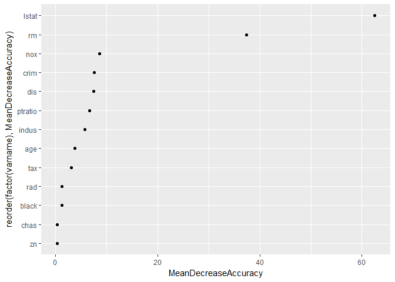
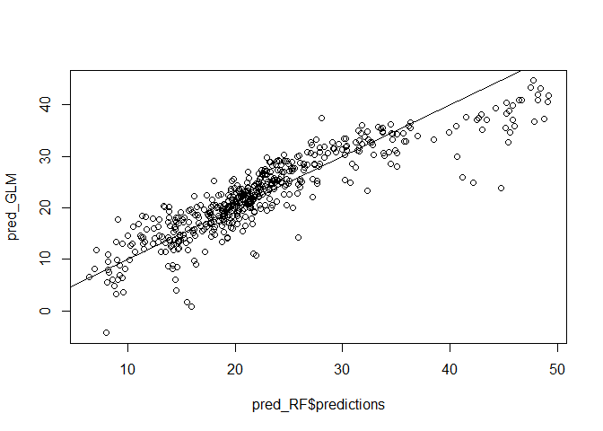
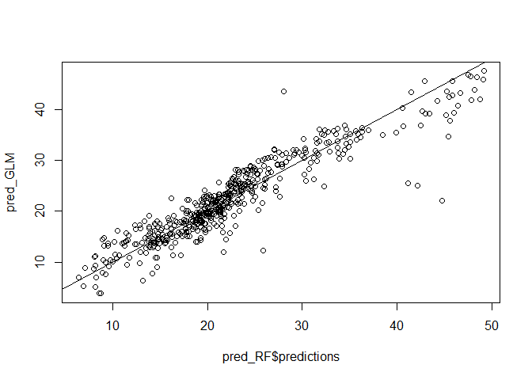
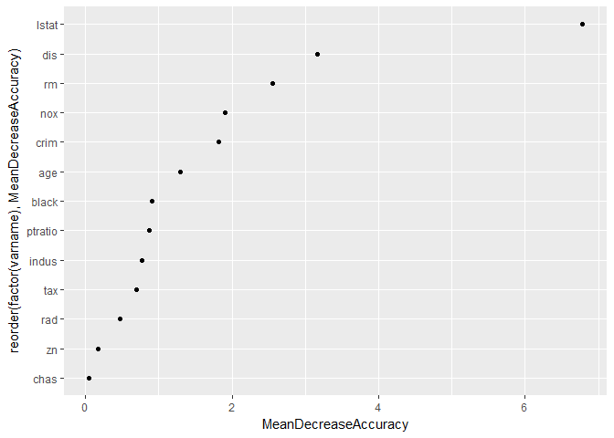
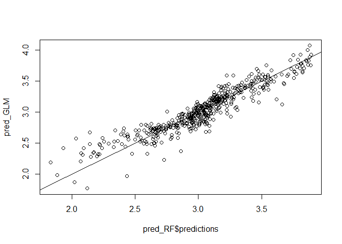
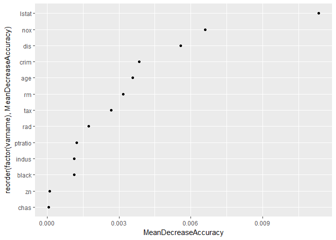
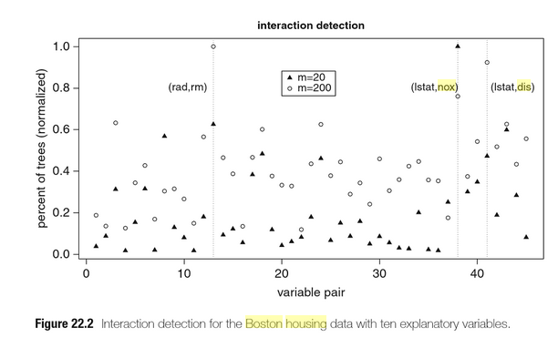

+++
title = "Interaction detection using Random Forest predictions"
date = 2017-09-24T16:54:08+01:00
draft = false

# Tags and categories
# For example, use `tags = []` for no tags, or the form `tags = ["A Tag", "Another Tag"]` for one or more tags.
tags = []
categories = []

# Featured image
# To use, add an image named `featured.jpg/png` to your page's folder. 
[image]
  # Caption (optional)
  caption = ""

  # Focal point (optional)
  # Options: Smart, Center, TopLeft, Top, TopRight, Left, Right, BottomLeft, Bottom, BottomRight
  focal_point = ""
+++


# summary

The idea is that comparing the predictions of an RF model with the predictions of an OLS model can inform us in what ways the OLS model fails to capture all non-linearities and interactions between the predictors. Subsequently, using partial dependence plots of the RF model can guide the modelling of the non-linearities in the OLS model. After this step, the discrepancies between the RF predictions and the OLS predictions should be caused by non-modeled interactions. Using an RF to predict the discrepancy itself can then be used to discover which predictors are involved in these interactions. We test this method on the classic `Boston Housing` dataset to predict median house values (`medv`). We indeed recover interactions that, as it turns, have already been found and documented in the literature.
  
# Load packages
  

```r
rm(list=ls())
library(randomForest)
library(party)
library(ranger)
library(data.table)
library(ggplot2)
library(MASS)

rdunif <- function(n,k) sample(1:k, n, replace = T)
```

# Step 1: Run a RF on the Boston Housing set


```r
my_ranger <- ranger(medv ~ ., data = Boston,
                                  importance = "permutation", num.trees = 500,
                                  mtry = 5, replace = TRUE)
```

Extract the permutation importance measure.


```r
myres_tmp <- ranger::importance(my_ranger);
myres <- cbind(names(myres_tmp), myres_tmp,  i = 1)
#my_rownames <- row.names(myres)
myres <- data.table(myres)
setnames(myres, "V1", "varname")
setnames(myres, "myres_tmp", "MeanDecreaseAccuracy")
myres <- myres[, varname := as.factor(varname)]
myres <- myres[, MeanDecreaseAccuracy := as.numeric(MeanDecreaseAccuracy)]
myres <- myres[, i := as.integer(i)]
```


```r
ggplot(myres, 
       aes(x = reorder(factor(varname), MeanDecreaseAccuracy), y = MeanDecreaseAccuracy)) + 
  geom_point() + coord_flip()
```

<!-- -->

# Fit an OLS to the Boston Housing


```r
my_glm <- glm(medv ~., data = Boston, 
              family = "gaussian")
```

# Compare predictions of both models


```r
pred_RF <- predict(my_ranger, data = Boston)
#pred_RF$predictions
pred_GLM <- predict(my_glm, data = Boston)

plot(pred_RF$predictions, pred_GLM)
abline(0, 1)
```

<!-- -->
# Run a RF on the discrepancy

Discrepancy is defined as the difference between the predictions of both models for each observation.


```r
pred_diff <- pred_RF$predictions - pred_GLM

my_ranger_diff <- ranger(Ydiff ~ . - medv, data = data.table(Ydiff = pred_diff, Boston),
                                  importance = "permutation", num.trees = 500,
                                  mtry = 5, replace = TRUE)
my_ranger_diff
```

```
## Ranger result
## 
## Call:
##  ranger(Ydiff ~ . - medv, data = data.table(Ydiff = pred_diff,      Boston), importance = "permutation", num.trees = 500, mtry = 5,      replace = TRUE) 
## 
## Type:                             Regression 
## Number of trees:                  500 
## Sample size:                      506 
## Number of independent variables:  13 
## Mtry:                             5 
## Target node size:                 5 
## Variable importance mode:         permutation 
## OOB prediction error (MSE):       5.17264 
## R squared (OOB):                  0.6617633
```

It turns out the RF can "explain" 67% of these discrepancies.


```r
myres_tmp <- ranger::importance(my_ranger_diff)
myres <- cbind(names(myres_tmp), myres_tmp,  i = 1)
#my_rownames <- row.names(myres)
myres <- data.table(myres)
setnames(myres, "V1", "varname")
setnames(myres, "myres_tmp", "MeanDecreaseAccuracy")
myres <- myres[, varname := as.factor(varname)]
myres <- myres[, MeanDecreaseAccuracy := as.numeric(MeanDecreaseAccuracy)]
myres <- myres[, i := as.integer(i)]
```


```r
ggplot(myres, 
       aes(x = reorder(factor(varname), MeanDecreaseAccuracy), y = MeanDecreaseAccuracy)) + 
  geom_point() + coord_flip()
```

<!-- -->

It turns out that `rm` and `lstat` are the variables that best predict the discrepancy.


```r
my_glm_int <- glm(medv ~. + rm:lstat, data = Boston, 
              family = "gaussian")
summary(my_glm_int)
```

```
## 
## Call:
## glm(formula = medv ~ . + rm:lstat, family = "gaussian", data = Boston)
## 
## Deviance Residuals: 
##      Min        1Q    Median        3Q       Max  
## -21.5738   -2.3319   -0.3584    1.8149   27.9558  
## 
## Coefficients:
##               Estimate Std. Error t value Pr(>|t|)    
## (Intercept)   6.073638   5.038175   1.206 0.228582    
## crim         -0.157100   0.028808  -5.453 7.85e-08 ***
## zn            0.027199   0.012020   2.263 0.024083 *  
## indus         0.052272   0.053475   0.978 0.328798    
## chas          2.051584   0.750060   2.735 0.006459 ** 
## nox         -15.051627   3.324807  -4.527 7.51e-06 ***
## rm            7.958907   0.488520  16.292  < 2e-16 ***
## age           0.013466   0.011518   1.169 0.242918    
## dis          -1.120269   0.175498  -6.383 4.02e-10 ***
## rad           0.320355   0.057641   5.558 4.49e-08 ***
## tax          -0.011968   0.003267  -3.664 0.000276 ***
## ptratio      -0.721302   0.115093  -6.267 8.06e-10 ***
## black         0.003985   0.002371   1.681 0.093385 .  
## lstat         1.844883   0.191833   9.617  < 2e-16 ***
## rm:lstat     -0.418259   0.032955 -12.692  < 2e-16 ***
## ---
## Signif. codes:  0 '***' 0.001 '**' 0.01 '*' 0.05 '.' 0.1 ' ' 1
## 
## (Dispersion parameter for gaussian family taken to be 16.98987)
## 
##     Null deviance: 42716  on 505  degrees of freedom
## Residual deviance:  8342  on 491  degrees of freedom
## AIC: 2886
## 
## Number of Fisher Scoring iterations: 2
```

The interaction we have added is indeed highly significant.

Compare approximate out-of-sample prediction accuracy using AIC:


```r
AIC(my_glm)
```

```
## [1] 3027.609
```

```r
AIC(my_glm_int)
```

```
## [1] 2886.043
```

Indeed, the addition of the interaction greatly increases the prediction accuracy.

# Repeat this process


```r
pred_RF <- predict(my_ranger, data = Boston)
#pred_RF$predictions
pred_GLM <- predict(my_glm_int, data = Boston)

plot(pred_RF$predictions, pred_GLM)
abline(0, 1)
```

<!-- -->

```r
pred_diff <- pred_RF$predictions - pred_GLM

my_ranger_diff2 <- ranger(Ydiff ~ . - medv, data = data.table(Ydiff = pred_diff, Boston),
                                  importance = "permutation", num.trees = 500,
                                  mtry = 5, replace = TRUE)
my_ranger_diff2
```

```
## Ranger result
## 
## Call:
##  ranger(Ydiff ~ . - medv, data = data.table(Ydiff = pred_diff,      Boston), importance = "permutation", num.trees = 500, mtry = 5,      replace = TRUE) 
## 
## Type:                             Regression 
## Number of trees:                  500 
## Sample size:                      506 
## Number of independent variables:  13 
## Mtry:                             5 
## Target node size:                 5 
## Variable importance mode:         permutation 
## OOB prediction error (MSE):       5.570852 
## R squared (OOB):                  0.4375935
```


```r
myres_tmp <- ranger::importance(my_ranger_diff2)
myres <- cbind(names(myres_tmp), myres_tmp,  i = 1)
#my_rownames <- row.names(myres)
myres <- data.table(myres)
setnames(myres, "V1", "varname")
setnames(myres, "myres_tmp", "MeanDecreaseAccuracy")
myres <- myres[, varname := as.factor(varname)]
myres <- myres[, MeanDecreaseAccuracy := as.numeric(MeanDecreaseAccuracy)]
myres <- myres[, i := as.integer(i)]
```


```r
ggplot(myres, 
       aes(x = reorder(factor(varname), MeanDecreaseAccuracy), y = MeanDecreaseAccuracy)) + 
  geom_point() + coord_flip()
```

<!-- -->

Now the variables that best predict the discrepancy are `lstat` and `dis`.
Add these two variables as an interaction.


```r
my_glm_int2 <- glm(medv ~. + rm:lstat + lstat:dis, data = Boston, 
              family = "gaussian")
summary(my_glm_int2)
```

```
## 
## Call:
## glm(formula = medv ~ . + rm:lstat + lstat:dis, family = "gaussian", 
##     data = Boston)
## 
## Deviance Residuals: 
##      Min        1Q    Median        3Q       Max  
## -23.3918   -2.2997   -0.4077    1.6475   27.6766  
## 
## Coefficients:
##               Estimate Std. Error t value Pr(>|t|)    
## (Intercept)   1.552991   5.107295   0.304 0.761201    
## crim         -0.139370   0.028788  -4.841 1.73e-06 ***
## zn            0.042984   0.012550   3.425 0.000667 ***
## indus         0.066690   0.052878   1.261 0.207834    
## chas          1.760779   0.743688   2.368 0.018290 *  
## nox         -11.544280   3.404577  -3.391 0.000753 ***
## rm            8.640503   0.513593  16.824  < 2e-16 ***
## age          -0.002127   0.012067  -0.176 0.860140    
## dis          -1.904982   0.268056  -7.107 4.22e-12 ***
## rad           0.304689   0.057000   5.345 1.39e-07 ***
## tax          -0.011220   0.003228  -3.476 0.000554 ***
## ptratio      -0.641380   0.115418  -5.557 4.51e-08 ***
## black         0.003756   0.002339   1.606 0.108924    
## lstat         1.925223   0.190368  10.113  < 2e-16 ***
## rm:lstat     -0.466947   0.034897 -13.381  < 2e-16 ***
## dis:lstat     0.076716   0.020009   3.834 0.000143 ***
## ---
## Signif. codes:  0 '***' 0.001 '**' 0.01 '*' 0.05 '.' 0.1 ' ' 1
## 
## (Dispersion parameter for gaussian family taken to be 16.52869)
## 
##     Null deviance: 42716.3  on 505  degrees of freedom
## Residual deviance:  8099.1  on 490  degrees of freedom
## AIC: 2873.1
## 
## Number of Fisher Scoring iterations: 2
```

```r
AIC(my_glm_int2)
```

```
## [1] 2873.087
```

```r
AIC(my_glm_int)
```

```
## [1] 2886.043
```

We conclude that the second interaction also results in significant model improvement.

# A more ambitious goal: Try and improve Harrison & Rubinfeld's model formula for Boston housing

So far, we assumed that all relationships are linear. 
Harrison and Rubinfeld have created a model without interactions, but with transformations to correct for skewness, heteroskedasticity etc.
Let's see if we can improve upon this model equation by applying our method to search for interactions.
Their formula predicts `log(medv)`.


```r
# Harrison and Rubinfeld (1978) model
my_glm_hr <- glm(log(medv) ~ I(rm^2) + age + log(dis) + log(rad) + tax + ptratio + 
                     black + I(black^2) + log(lstat) + crim + zn + indus + chas + I(nox^2), data = Boston, 
              family = "gaussian")

summary(my_glm_hr)
```

```
## 
## Call:
## glm(formula = log(medv) ~ I(rm^2) + age + log(dis) + log(rad) + 
##     tax + ptratio + black + I(black^2) + log(lstat) + crim + 
##     zn + indus + chas + I(nox^2), family = "gaussian", data = Boston)
## 
## Deviance Residuals: 
##      Min        1Q    Median        3Q       Max  
## -0.73091  -0.09274  -0.00710   0.09800   0.78607  
## 
## Coefficients:
##               Estimate Std. Error t value Pr(>|t|)    
## (Intercept)  4.474e+00  1.579e-01  28.343  < 2e-16 ***
## I(rm^2)      6.634e-03  1.313e-03   5.053 6.15e-07 ***
## age          3.491e-05  5.245e-04   0.067 0.946950    
## log(dis)    -1.927e-01  3.325e-02  -5.796 1.22e-08 ***
## log(rad)     9.613e-02  1.905e-02   5.047 6.35e-07 ***
## tax         -4.295e-04  1.222e-04  -3.515 0.000481 ***
## ptratio     -2.977e-02  5.024e-03  -5.926 5.85e-09 ***
## black        1.520e-03  5.068e-04   3.000 0.002833 ** 
## I(black^2)  -2.597e-06  1.114e-06  -2.331 0.020153 *  
## log(lstat)  -3.695e-01  2.491e-02 -14.833  < 2e-16 ***
## crim        -1.157e-02  1.246e-03  -9.286  < 2e-16 ***
## zn           7.257e-05  5.034e-04   0.144 0.885430    
## indus       -1.943e-04  2.360e-03  -0.082 0.934424    
## chas         9.180e-02  3.305e-02   2.777 0.005690 ** 
## I(nox^2)    -6.566e-01  1.129e-01  -5.815 1.09e-08 ***
## ---
## Signif. codes:  0 '***' 0.001 '**' 0.01 '*' 0.05 '.' 0.1 ' ' 1
## 
## (Dispersion parameter for gaussian family taken to be 0.03299176)
## 
##     Null deviance: 84.376  on 505  degrees of freedom
## Residual deviance: 16.199  on 491  degrees of freedom
## AIC: -273.48
## 
## Number of Fisher Scoring iterations: 2
```

```r
my_ranger_log <- ranger(log(medv) ~ ., data = Boston,
                                  importance = "permutation", num.trees = 500,
                                  mtry = 5, replace = TRUE)
```


```r
pred_RF <- predict(my_ranger_log, data = Boston)
#pred_RF$predictions
pred_GLM <- predict(my_glm_hr, data = Boston)

plot(pred_RF$predictions, pred_GLM)
abline(0, 1)
```

<!-- -->

For low predicted values both models differ in a systematic way.
This suggests that there exists a remaining pattern that is picked up by RF but not by the OLS model.


```r
pred_diff <- pred_RF$predictions - pred_GLM

my_ranger_log_diff <- ranger(Ydiff ~ . - medv, data = data.table(Ydiff = pred_diff, Boston),
                                  importance = "permutation", num.trees = 500,
                                  mtry = 5, replace = TRUE)
my_ranger_log_diff
```

```
## Ranger result
## 
## Call:
##  ranger(Ydiff ~ . - medv, data = data.table(Ydiff = pred_diff,      Boston), importance = "permutation", num.trees = 500, mtry = 5,      replace = TRUE) 
## 
## Type:                             Regression 
## Number of trees:                  500 
## Sample size:                      506 
## Number of independent variables:  13 
## Mtry:                             5 
## Target node size:                 5 
## Variable importance mode:         permutation 
## OOB prediction error (MSE):       0.009100275 
## R squared (OOB):                  0.5311914
```

The RF indicates that 54% of the discrepancy can be "explained" by RF.


```r
myres_tmp <- ranger::importance(my_ranger_log_diff)
myres <- cbind(names(myres_tmp), myres_tmp,  i = 1)
#my_rownames <- row.names(myres)
myres <- data.table(myres)
setnames(myres, "V1", "varname")
setnames(myres, "myres_tmp", "MeanDecreaseAccuracy")
myres <- myres[, varname := as.factor(varname)]
myres <- myres[, MeanDecreaseAccuracy := as.numeric(MeanDecreaseAccuracy)]
myres <- myres[, i := as.integer(i)]
```


```r
ggplot(myres, 
       aes(x = reorder(factor(varname), MeanDecreaseAccuracy), y = MeanDecreaseAccuracy)) + 
  geom_point() + coord_flip()
```

<!-- -->

Add the top 2 vars as an interaction to their model equation.


```r
my_glm_hr_int <- glm(log(medv) ~ I(rm^2) + age + log(dis) + log(rad) + tax + ptratio + 
                     black + I(black^2) + log(lstat) + crim + zn + indus + chas + I(nox^2) +
                   lstat:nox, data = Boston, 
              family = "gaussian")
summary(my_glm_hr_int)
```

```
## 
## Call:
## glm(formula = log(medv) ~ I(rm^2) + age + log(dis) + log(rad) + 
##     tax + ptratio + black + I(black^2) + log(lstat) + crim + 
##     zn + indus + chas + I(nox^2) + lstat:nox, family = "gaussian", 
##     data = Boston)
## 
## Deviance Residuals: 
##      Min        1Q    Median        3Q       Max  
## -0.70340  -0.09274  -0.00665   0.10068   0.75004  
## 
## Coefficients:
##               Estimate Std. Error t value Pr(>|t|)    
## (Intercept)  4.243e+00  1.613e-01  26.304  < 2e-16 ***
## I(rm^2)      7.053e-03  1.286e-03   5.484 6.66e-08 ***
## age         -3.146e-04  5.174e-04  -0.608  0.54354    
## log(dis)    -2.254e-01  3.317e-02  -6.795 3.15e-11 ***
## log(rad)     9.829e-02  1.862e-02   5.278 1.96e-07 ***
## tax         -4.589e-04  1.196e-04  -3.838  0.00014 ***
## ptratio     -2.990e-02  4.910e-03  -6.089 2.30e-09 ***
## black        1.445e-03  4.955e-04   2.917  0.00370 ** 
## I(black^2)  -2.470e-06  1.089e-06  -2.268  0.02376 *  
## log(lstat)  -2.143e-01  3.989e-02  -5.373 1.20e-07 ***
## crim        -1.046e-02  1.238e-03  -8.448 3.40e-16 ***
## zn           7.309e-04  5.099e-04   1.434  0.15234    
## indus       -8.166e-05  2.307e-03  -0.035  0.97178    
## chas         8.746e-02  3.231e-02   2.707  0.00704 ** 
## I(nox^2)    -3.618e-01  1.256e-01  -2.880  0.00415 ** 
## lstat:nox   -2.367e-02  4.819e-03  -4.911 1.24e-06 ***
## ---
## Signif. codes:  0 '***' 0.001 '**' 0.01 '*' 0.05 '.' 0.1 ' ' 1
## 
## (Dispersion parameter for gaussian family taken to be 0.03150809)
## 
##     Null deviance: 84.376  on 505  degrees of freedom
## Residual deviance: 15.439  on 490  degrees of freedom
## AIC: -295.79
## 
## Number of Fisher Scoring iterations: 2
```

```r
AIC(my_glm_hr)
```

```
## [1] -273.4788
```

```r
AIC(my_glm_hr_int)
```

```
## [1] -295.7931
```

This results in a significant improvement!

# Repeat this procedure


```r
pred_RF <- predict(my_ranger_log, data = Boston)
#pred_RF$predictions
pred_GLM <- predict(my_glm_hr_int, data = Boston)

plot(pred_RF$predictions, pred_GLM)
abline(0, 1)
```

<!-- -->


```r
pred_diff <- pred_RF$predictions - pred_GLM

my_ranger_log_diff2 <- ranger(Ydiff ~ . - medv, data = data.table(Ydiff = pred_diff, Boston),
                                  importance = "permutation", num.trees = 500,
                                  mtry = 5, replace = TRUE)
my_ranger_log_diff2
```

```
## Ranger result
## 
## Call:
##  ranger(Ydiff ~ . - medv, data = data.table(Ydiff = pred_diff,      Boston), importance = "permutation", num.trees = 500, mtry = 5,      replace = TRUE) 
## 
## Type:                             Regression 
## Number of trees:                  500 
## Sample size:                      506 
## Number of independent variables:  13 
## Mtry:                             5 
## Target node size:                 5 
## Variable importance mode:         permutation 
## OOB prediction error (MSE):       0.008703804 
## R squared (OOB):                  0.5204124
```

```r
myres_tmp <- ranger::importance(my_ranger_log_diff2)
myres <- cbind(names(myres_tmp), myres_tmp,  i = 1)
#my_rownames <- row.names(myres)
myres <- data.table(myres)
setnames(myres, "V1", "varname")
setnames(myres, "myres_tmp", "MeanDecreaseAccuracy")
myres <- myres[, varname := as.factor(varname)]
myres <- myres[, MeanDecreaseAccuracy := as.numeric(MeanDecreaseAccuracy)]
myres <- myres[, i := as.integer(i)]
```


```r
ggplot(myres, 
       aes(x = reorder(factor(varname), MeanDecreaseAccuracy), y = MeanDecreaseAccuracy)) + 
  geom_point() + coord_flip()
```

<!-- -->

Now we add lstat and  dis as an interaction.


```r
my_glm_hr_int2 <- glm(log(medv) ~ I(rm^2) + age + log(dis) + log(rad) + tax + ptratio + 
                     black + I(black^2) + log(lstat) + crim + zn + indus + chas + I(nox^2) +
                   lstat:nox + lstat:dis, data = Boston, 
              family = "gaussian")
summary(my_glm_hr_int2)
```

```
## 
## Call:
## glm(formula = log(medv) ~ I(rm^2) + age + log(dis) + log(rad) + 
##     tax + ptratio + black + I(black^2) + log(lstat) + crim + 
##     zn + indus + chas + I(nox^2) + lstat:nox + lstat:dis, family = "gaussian", 
##     data = Boston)
## 
## Deviance Residuals: 
##      Min        1Q    Median        3Q       Max  
## -0.70136  -0.08746  -0.00589   0.08857   0.76349  
## 
## Coefficients:
##               Estimate Std. Error t value Pr(>|t|)    
## (Intercept)  4.535e+00  1.712e-01  26.481  < 2e-16 ***
## I(rm^2)      7.498e-03  1.266e-03   5.924 5.94e-09 ***
## age         -1.262e-03  5.504e-04  -2.293  0.02226 *  
## log(dis)    -4.065e-01  5.203e-02  -7.813 3.43e-14 ***
## log(rad)     9.668e-02  1.828e-02   5.290 1.85e-07 ***
## tax         -4.622e-04  1.173e-04  -3.940 9.35e-05 ***
## ptratio     -2.640e-02  4.881e-03  -5.409 9.93e-08 ***
## black        1.313e-03  4.871e-04   2.696  0.00727 ** 
## I(black^2)  -2.172e-06  1.071e-06  -2.029  0.04303 *  
## log(lstat)  -3.181e-01  4.553e-02  -6.987 9.23e-12 ***
## crim        -1.049e-02  1.215e-03  -8.635  < 2e-16 ***
## zn           9.078e-04  5.019e-04   1.809  0.07108 .  
## indus       -2.733e-04  2.264e-03  -0.121  0.90395    
## chas         7.166e-02  3.191e-02   2.246  0.02515 *  
## I(nox^2)    -2.569e-01  1.255e-01  -2.048  0.04113 *  
## lstat:nox   -2.729e-02  4.798e-03  -5.689 2.21e-08 ***
## lstat:dis    3.906e-03  8.754e-04   4.462 1.01e-05 ***
## ---
## Signif. codes:  0 '***' 0.001 '**' 0.01 '*' 0.05 '.' 0.1 ' ' 1
## 
## (Dispersion parameter for gaussian family taken to be 0.03033711)
## 
##     Null deviance: 84.376  on 505  degrees of freedom
## Residual deviance: 14.835  on 489  degrees of freedom
## AIC: -313.99
## 
## Number of Fisher Scoring iterations: 2
```

```r
AIC(my_glm_hr_int2)
```

```
## [1] -313.9904
```

```r
AIC(my_glm_hr_int)
```

```
## [1] -295.7931
```


And again we find an improvement in model fit.

# Have these interactions already been reported on in the literature?


Tom Minka reports on his website an analysis of interactions in the Boston Housing set:

(http://alumni.media.mit.edu/~tpminka/courses/36-350.2001/lectures/day30/)
`
> summary(fit3)
Coefficients:
                  Estimate Std. Error t value Pr(>|t|)    
(Intercept)      -227.5485    49.2363  -4.622 4.87e-06 ***
lstat              50.8553    20.3184   2.503 0.012639 *  
rm                 38.1245     7.0987   5.371 1.21e-07 ***
dis               -16.8163     2.9174  -5.764 1.45e-08 ***
ptratio            14.9592     2.5847   5.788 1.27e-08 ***
lstat:rm           -6.8143     3.1209  -2.183 0.029475 *  
lstat:dis           4.8736     1.3940   3.496 0.000514 ***
lstat:ptratio      -3.3209     1.0345  -3.210 0.001412 ** 
rm:dis              2.0295     0.4435   4.576 5.99e-06 ***
rm:ptratio         -1.9911     0.3757  -5.299 1.76e-07 ***
lstat:rm:dis       -0.5216     0.2242  -2.327 0.020364 *  
lstat:rm:ptratio    0.3368     0.1588   2.121 0.034423 *  
`

Rob mcCulloch, using BART (bayesian additive regression trees) also examines interactions in the Boston Housing data.
There the co-occurence within trees is used to discover interactions:

`The second, interaction detection, uncovers which pairs of variables interact in analogous fashion by keeping track of the percentage of trees in the sum in which both variables occur.  This exploits the fact that a sum-of-trees model captures an interaction between xi and xj by using them both for splitting rules in the same tree.`

http://www.rob-mcculloch.org/some_papers_and_talks/papers/working/cgm_as.pdf



# Conclusion

We conclude that this appears a fruitfull approach to at least discovering where a regression model can be improved.
